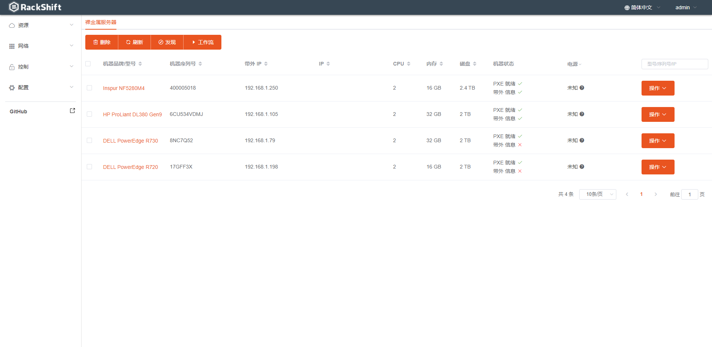
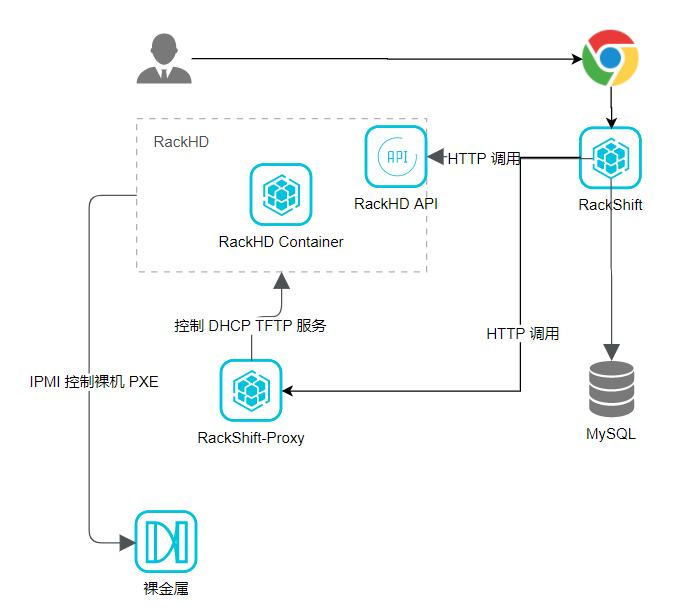

# RackShift

[](https://app.codacy.com/gh/rackshift/rackshift?utm_source=github.com&utm_medium=referral&utm_content=rackshift/rackshift&utm_campaign=Badge_Grade)
| Developer Wanted                                                                                             |
| ------------------------------------------------------------------------------------------------------------ |
| 我们正在寻找开发者，欢迎加入我们共同打造更好用、更强大的 RackShift。联系我们： [dahai.zhang@fit2cloud.com](mailto:dahai.zhang@fit2cloud.com) |

RackShift 是完全开源的裸金属服务器装机管理平台，功能覆盖裸金属服务器的发现、带外管理、系统安装（包含 RAID 配置）等。RackShift 基于任务工作流，提供可视化的 WebUI，支持市面上主流 X86 物理服务器品牌，如浪潮、戴尔、华为、联想、惠普等。



## 解决的问题
- 各种网络环境下裸金属服务器的自动、手动发现；
- 裸金属服务器的带外控制管理，包括开关机、重启、配置 PXE 等；
- 裸金属服务器批量装机、RAID配置和固件更新。

## 技术优势
  
- 全生命周期: 能够覆盖裸金属从发现、配置、装机、重置的全生命周期管理；
- 自动化：基于 PXE 或者带外协议实现远程自动化，解放机房运维人员；
- 易操作: 浏览器可视化操作界面，易于操作和管理。

## 功能列表

<table class="wrapped confluenceTable"><colgroup><col><col></colgroup><tbody><tr><td class="confluenceTd">自动化</td><td class="confluenceTd">支持主流品牌裸金属服务器的 PXE / IPMI / SNMP / HTTP 自动发现与自动配置</td></tr><tr><td class="confluenceTd">速度</td><td class="confluenceTd">无人值守安装 Ubuntu， CentOS, Windows 和 RHEL，部署完毕只需要重启一次，整个部署时间不超过8分钟</td></tr><tr><td colspan="1" class="confluenceTd">信息纳管</td><td colspan="1" class="confluenceTd">收集硬件设备信息， CPU， 内存， RAID 控制器， 磁盘， 网卡等，自动检测硬件变更</td></tr><tr><td colspan="1" class="confluenceTd">网络探测</td><td colspan="1" class="confluenceTd">支持通过多种协议自动探测网络中的硬件设备</td></tr><tr><td colspan="1" class="confluenceTd">存储优化</td><td colspan="1" class="confluenceTd">用户可选的 RAID ， Bcache ，LVM 存储配置</td></tr><tr><td colspan="1" class="confluenceTd">多样的管理工具</td><td colspan="1" class="confluenceTd">支持多种品牌的官方管理工具如 DELL Racadm，HP SMH 等等</td></tr></tbody></table>

详细的版本规划请参考 [版本路线图](https://github.com/rackshift/rackshift/blob/master/ROADMAP.md)  

如果您想进一步了解目前的开发进度请查看
[开发进度](https://github.com/rackshift/rackshift/projects/1)  

## 技术架构


组件说明：

- RackShift-Web： RackShift 前端界面，基于 VUE2.6.11 开发的单页应用；
- RackShift-Server： RackShift 后台服务，基于 SpringBoot 框架，对底层管理裸金属服务器能力进行更高层的抽象；
- RackShift-Proxy： 用于控制注入镜像下发，DHCP 配置，远程 KVM 等等；
- RackHD： EMC 开源的裸金属管理软件，现已停止维护，RackShift 项目对其进行了大量优化和集成；
- MySQL：RackShift-Server 主要运行数据的存储区；
- Mongo：RackHD 与 RackShift-Server 的运行数据存储区；
- RabbitMQ: 各组件之间通信中间件；
- DockerEngine：各组件的容器运行时。

## 组件调用关系


## 技术栈

- 前端: [Vue.js](https://vuejs.org/)
- 后端: [Spring Boot](https://www.tutorialspoint.com/spring_boot/spring_boot_introduction.htm)
- 数据库: [MySQL](https://www.mysql.com/)

## 快速开始

仅需两步快速安装 RackShift：

 * 准备一台不小于 8G 内存，50G 硬盘且可以访问互联网的 64位 Linux 主机；
 * 以 root 用户执行如下命令一键安装 RackShift。
```sh
curl -sSL https://github.com/rackshift/rackshift/releases/latest/download/quick_start.sh | sh
```

## 体验环境
- http://149.129.105.194:8080/ 账号密码 admin / 123
## 帮助文档
- [帮助文档](http://149.129.105.194:8081)

## 微信群


如果看不到图片请先加入 QQ 群（693376431）或者打开帮助文档页面扫描加入
- [二维码](http://149.129.105.194:8081/about/)

## QQ 群
- 693376431

## 致谢

-  [RackHD](https://rackhd.github.io/)：RackShift 集成和参考了 RackHD 提供的裸金属服务器管理能力和思路；
-  [MAAS](https://maas.io/)：RackShift 参考了 MAAS 提供的裸金属生命周期纳管思路；
-  [Digital Rebar](https://rackn.com/rebar/)：RackShift 参考了 Digital Rebar 提供的操作方式和 UI 参考；
-  [Element](https://element.eleme.cn/#/)：RackShift 使用 Element 提供的优秀前端组件库。
