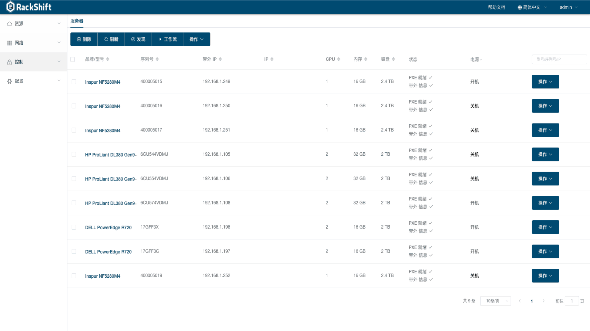
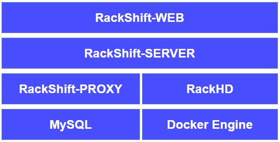

<p align="center"><a href="https://rackshift.io"></a></p>
<h3 align="center">开源裸金属服务器管理平台</h3>

<p align="center">
  <a href="https://app.codacy.com/gh/rackshift/rackshift?utm_source=github.com&utm_medium=referral&utm_content=rackshift/rackshift&utm_campaign=Badge_Grade"></a>
  <a href="https://www.gnu.org/licenses/old-licenses/gpl-2.0"></a>
  <a href="https://github.com/rackshift/rackshift/releases/latest"></a>
  <a href="https://github.com/rackshift/rackshift"></a>
  <a href="https://github.com/rackshift/rackshift/releases"></a>
</p>
<hr />

RackShift 是开源的裸金属服务器管理平台，功能覆盖裸金属服务器的发现、带外管理、RAID 配置、固件更新、操作系统安装等。

RackShift 要解决的问题包括：

- 各种网络环境下裸金属服务器的自动、手动发现；
- 裸金属服务器的带外控制管理，包括开关机、重启、配置 PXE 等；
- 裸金属服务器批量 RAID 配置、固件更新、装机等。

RackShift 遵循 GPL v2 开源协议，使用 SpringBoot/Vue 进行开发，界面美观、用户体验好，集成并扩展 RackHD，支持的X86 服务器品牌包括浪潮、戴尔、华为、联想、惠普等。

RackShift 的技术优势包括：

- 全生命周期: 能够覆盖裸金属服务器从发现、配置、装机、重置的全生命周期管理；
- 自动化：基于 PXE 或者带外协议实现远程自动化，解放机房运维人员；
- 易操作: 浏览器可视化操作界面，易于操作和管理。


## UI 界面展示



## 快速开始

仅需两步快速安装 RackShift：

* 准备一台不小于 8G 内存，50G 硬盘且可以访问互联网的 64位 Linux 主机；
* 以 root 用户执行如下命令一键安装 RackShift。

```sh
sh -c "$(curl -sSL https://github.com/rackshift/rackshift/releases/latest/download/quick_start.sh)"
```
文档和演示视频：

-  [帮助文档](https://docs.rackshift.io/)
-  [演示视频](https://www.bilibili.com/video/BV19y4y1t75E)

## 微信群


## 技术架构



RackShift的技术栈如下：

- 前端: [Vue.js](https://vuejs.org/)
- 后端: [Spring Boot](https://www.tutorialspoint.com/spring_boot/spring_boot_introduction.htm)
- 数据库: [MySQL](https://www.mysql.com/)

RackShift 使用、集成、借鉴的开源项目如下，在此致谢：

-  [RackHD](https://rackhd.github.io/)：RackShift 集成和参考了 RackHD 提供的裸金属服务器管理能力和思路；
-  [MAAS](https://maas.io/)：RackShift 参考了 MAAS 提供的裸金属服务器生命周期纳管思路；
-  [Digital Rebar](https://rackn.com/rebar/)：RackShift 参考了 Digital Rebar 提供的操作方式和 UI 参考；
-  [Element](https://element.eleme.cn/#/)：RackShift 使用 Element 提供的优秀前端组件库。

## License & Copyright

Copyright (c) 2014-2022 飞致云 FIT2CLOUD, All rights reserved.

Licensed under The GNU General Public License version 3 (GPLv3)  (the "License"); you may not use this file except in compliance with the License. You may obtain a copy of the License at

https://www.gnu.org/licenses/gpl-3.0.html

Unless required by applicable law or agreed to in writing, software distributed under the License is distributed on an "AS IS" BASIS, WITHOUT WARRANTIES OR CONDITIONS OF ANY KIND, either express or implied. See the License for the specific language governing permissions and limitations under the License.
